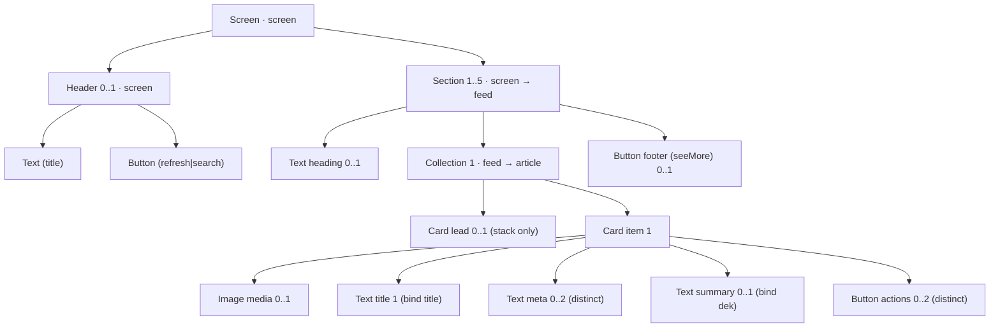

# Proteus component grammar v0.2 — design notes

Status: draft, 2026-09-10. Grammar source: [`src/grammars/newsfeed.ts`](../src/grammars/newsfeed.ts).
Run `npm run check` to regenerate the JSON Schema and validate every example.

## 1. What the grammar is

A Proteus grammar is a **typed, bounded context-free grammar over UI components**.
A UI tree that satisfies it *is* a derivation: every node is a production choice,
every prop is a parameter choice. That derivation is the object the runtime model
(bandit, later a world model) picks. Nothing downstream needs any other notion of
"action".

There are two typing layers, and both are needed for the grammar to be bounded:

| Layer | What it constrains | Example |
|---|---|---|
| **Structural** | Which component types may fill which slot, with what cardinality; enum-valued props | `Card.actions` accepts 0–2 `Button`s |
| **Data context** | Which fields a leaf may bind, given where it sits in the tree | a `Text` inside a `Card` may bind `title`, not `greeting` |

Rules that keep the derivation space finite and meaningful:

1. **No free strings.** A leaf either binds a field of its data context or references a
   developer-declared string key. The model never writes copy.
2. **No recursion.** `Screen → Section → Collection → Card → leaf` is the only path. Max depth 4.
3. **Every slot has a max cardinality. Every prop is an enum with no default**, so a derivation is fully explicit.
4. **Cross-node constraints are declarative** (`when variant=hero, requireSlot media`) so they compile
   to JSON Schema and are honoured by the derivation counter.
5. **Content, ranking and theme are out of scope.** Feeds arrive already ranked; the grammar chooses
   presentation of ranked data. Colours and spacing are the renderer's.

## 2. App choice: a reading / news feed home screen

Think Apple News, Pocket, Artifact. Chosen because:

- Engagement signals are dense and cheap: tap, dwell, scroll-past, save, dismiss, "see more".
- Presentation genuinely differs between users (hero cards vs dense lists vs carousels), which is
  what a personalising model needs to exploit.
- No transaction step, so the reward is not confounded by price or inventory.

## 3. Data contexts

The grammar declares three contexts. `Section` binds a feed and switches its children into `feed`
context; `Collection`'s item templates run in `article` context.

| Context | Fields (kind) | Established by |
|---|---|---|
| `screen` | `greeting`, `todayDate` (text) | root |
| `feed` | `name` (text) | `Section.slots.*` |
| `article` | `title`, `dek`, `source`, `author`, `publishedAt`, `readTime`, `topic` (text); `imageUrl` (image) | `Collection.slots.lead`, `Collection.slots.item` |



## 4. Components

Eight components. Props are string enums; slots list accepted types and cardinality.

| Component | Context | Props | Slots | Constraints |
|---|---|---|---|---|
| `Screen` (root) | screen | `density: comfortable \| compact` | `header: Header 0..1` · `sections: Section 1..5` | — |
| `Header` | screen | — | `title: Text 1 (role=title)` · `action: Button 0..1` | — |
| `Section` | screen | `source: topStories \| forYou \| following \| continueReading \| saved` | `heading: Text 0..1 (role=title\|label)` · `content: Collection 1` · `footer: Button 0..1` — all in **feed** context | — |
| `Collection` | feed | `layout: stack \| carousel \| grid` · `limit: 3 \| 5 \| 10` | `lead: Card 0..1` · `item: Card 1` — both in **article** context | grid ⇒ item.variant=standard · carousel ⇒ item.variant∈{hero,standard} · grid/carousel ⇒ no lead |
| `Card` | article | `variant: hero \| standard \| compact` | `media: Image 0..1` · `title: Text 1 (role=title, bind title)` · `meta: Text 0..2 distinct (role=caption\|label, bind source\|author\|publishedAt\|readTime\|topic)` · `summary: Text 0..1 (role=body, bind dek)` · `actions: Button 0..2 distinct` | hero ⇒ media required · compact ⇒ no summary · compact ⇒ media.aspect=1:1 |
| `Text` | screen, feed, article | `role: title \| body \| caption \| label` · `maxLines: 1 \| 2 \| 3` | leaf: `bind` a text field **or** `key` a string | caption/label ⇒ maxLines=1 |
| `Image` | article | `aspect: 16:9 \| 4:3 \| 1:1` | leaf: `bind` an image field | — |
| `Button` | screen, feed, article | `action` (by context: screen → refresh, search · feed → seeMore · article → read, save, share, follow, dismiss) · `style: primary \| secondary \| ghost` | leaf, no content (label/icon derived from `action`) | — |

Design decisions worth calling out:

- **`Section` owns the data binding, `Collection` owns the layout.** That separation lets a
  heading bind `feed.name` and a footer act on the feed, while the same `Collection` can be reused
  under any source.
- **`lead` + `item` templates.** The single most common feed pattern is "one big card, then a list".
  A single item template cannot express it; two full sections on the same source would show items
  twice. A `lead` template for the first item (stack only) covers it cleanly.
- **`Button` has no label choice.** An early draft let the model pick a label key independently of
  the action, which multiplied the space by 5 with 4 of every 5 combinations being nonsense
  ("Share" on a save button). Labels are a renderer lookup from `action`.
- **Slot-level binding restrictions (`childBind`).** Without them a card titled by `readTime` was a
  legal derivation. Counting the space (section 6) is what surfaced this.
- **Props are string enums, even `limit`.** The bandit sees categorical choices; the renderer parses.
- **`Screen.density` is the one theme-level knob.** Spacing is otherwise the renderer's, but a global
  comfortable/compact scale is a real personalisation axis (power readers vs browsers) and it is one
  choice per screen, so it costs the action space almost nothing. It constrains nothing else in the
  grammar; the renderer maps it to spacing tokens.

## 5. Node encoding

Grammar-agnostic shape ([`src/tree.ts`](../src/tree.ts)):

```json
{ "type": "Card", "props": { "variant": "hero" },
  "slots": { "media": { "type": "Image", "props": { "aspect": "16:9" }, "bind": "imageUrl" },
             "title": { "type": "Text", "props": { "role": "title", "maxLines": "3" }, "bind": "title" },
             "actions": [ { "type": "Button", "props": { "action": "save", "style": "ghost" } } ] } }
```

- Slots with max cardinality 1 hold a node; others hold an array. This matches the natural TypeScript
  type (`media?: ImageNode; meta?: TextNode[]`).
- No `id` field. A node's path (`sections[1].content.item.actions[0]`) is its identity, stable across
  derivations that share structure. That is what per-slot reward attribution will key on later.
- A tree travels inside an envelope, `{ "grammar": "newsfeed@0.2.0", "tree": { ... } }`. The
  compiled schema pins the exact grammar id, so a renderer refuses a tree derived from any other
  version instead of misrendering it.

## 6. Sanity checks

### 6.1 Three real layouts it expresses ([`examples/valid/`](../examples/valid/))

| Example | Persona | What it exercises |
|---|---|---|
| `editorial-home.json` | magazine reader | Header with greeting + search; Top Stories as hero lead + standard stack with two meta fields and a See More footer; For You as a standard-card carousel |
| `dense-list.json` | power reader | No header; three compact stacks (continue reading, for you ×10 with 1:1 thumbnails + save, following with dismiss); label-style headings |
| `visual-grid.json` | visual browser | Hero carousel with no heading; For You as a 2-up grid bound to the feed name; Saved as compact rows with dismiss |

### 6.2 Fourteen things it correctly refuses ([`examples/invalid/`](../examples/invalid/))

Each file breaks exactly one rule; the validator reports the offending path and the allowed values.

| Example | Rule exercised |
|---|---|
| `hero-without-media` | requireSlot constraint |
| `grid-of-compact-cards` | cross-node childProps constraint |
| `lead-card-in-carousel` | forbidSlot constraint |
| `screen-field-bound-inside-card` | data-context typing (`greeting` not in `article`) |
| `article-action-in-header` | context-dependent prop values (`save` not legal in `screen`) |
| `free-text-string` | no free strings (`text` is not a property) |
| `card-title-from-string-key` | childContent: card titles must bind |
| `card-title-bound-to-readtime` | childBind: title slot binds `title` only |
| `three-line-caption` | propIn constraint (caption ⇒ maxLines 1) |
| `card-inside-card` | slot type acceptance (no recursion) |
| `too-many-sections` | cardinality |
| `screen-missing-density` | all declared props are required |
| `wrong-grammar-version` | envelope pins the grammar id (a 0.1.0 tree, which predates `density`) |
| `missing-envelope` | bare tree without envelope |

### 6.3 Size of the derivation space (`npm run count`)

Exact counts, honouring every constraint. Ordered sequences in array slots count as distinct.

| Node | Derivations |
|---|---|
| `Button@article` | 15 |
| `Card@article` (compact only) | 137 k |
| `Card@article` | 2.05 M |
| `Collection@feed` | 1.3 × 10¹³ |
| `Section@screen` | 8.4 × 10¹⁵ |
| `Screen@screen` | 1.5 × 10⁸² |

Two consequences for the ML layer, noted here only so the grammar does not paint it into a corner:

- The bandit cannot treat derivations as arms. It has to score **per-slot choices** conditioned on
  the path (a factored / structured action space), which the tree encoding already supports.
- Most of the remaining volume is in ordered, multi-child slots (`meta`, `actions`) and in
  `Screen.sections` sequences. Those are also the choices least likely to matter, so they are
  candidates for freezing or tying in early experiments.

### 6.4 What it cannot express yet (deliberate v0.1 gaps)

- Mixed item templates beyond lead + rest (e.g. alternating layouts).
- Non-feed blocks between sections: promos, topic chips, "you're all caught up", empty states.
- Navigation (tabs, bottom bar), search UI, article detail screen.
- "Distinct by field" for array slots. `distinct` compiles to JSON Schema `uniqueItems`, which
  rejects `[save, save]` but not `[save ghost, save primary]`. A semantic check or per-slot
  enumeration would close this.

## 7. Schema format recommendation

Use **three artifacts with one source of truth**:

1. **Grammar spec in TypeScript** (`newsfeed.ts`, `as const satisfies Grammar`). Developer-authored,
   type-checked against the meta-types in `grammar-types.ts`. This is the compile-time contract the
   framework is built around, so it should be data, not hand-written per-app types.
2. **JSON Schema, generated** (`schema/newsfeed.schema.json`, draft 2020-12). Produced by
   `compile-schema.ts`. Every reachable (component, context) pair becomes its own definition
   (`Text@article`, `Button@feed`, ...), which is how the data-context layer lands in plain JSON Schema
   with no second-pass validator. The compiler also type-checks the grammar itself: a slot that
   would place `Image` in `screen` context, or a narrowing that names an unknown prop, is a compile error.
3. **TypeScript node types for the renderer, generated later** from the JSON Schema
   (`json-schema-to-typescript`) or from the grammar directly. Not written yet; the generic `UINode`
   is enough for now.

Why not the alternatives:

- *Hand-written JSON Schema*: would drift from the grammar and cannot express "type-check the
  grammar" at all.
- *Zod-first*: fine for one app, but Zod schemas are code, and the framework needs the grammar as
  data to derive the action space for the bandit. Zod can still be generated from the JSON Schema
  if runtime TS validation is wanted.
- *A custom grammar file format*: more tooling for no gain over a typed TS object.

The generated JSON Schema pays for itself twice more downstream: it is a ready-made
constrained-decoding grammar if an LLM ever proposes trees, and it is the precise action-space spec
the on-device scorer must respect.

## 8. Open questions for v0.2

- Should `Section.source` be a prop (as now) or a binding into a `feeds` collection on the screen
  context? A binding generalises to arbitrary developer-defined feeds; a prop keeps the enum visible
  to the bandit. Leaning: keep the prop, generate its values from the app's feed registry.
- Grammar migration: the envelope pins a version, but nothing yet upgrades logged derivations when a slot is added.
- Whether `maxLines` and `aspect` are presentation choices worth personalising or should be
  renderer defaults keyed on `variant` and `density`. Cutting them shrinks `Card` by roughly 10×.
- Reward attribution granularity: per node path, per subtree, or per whole screen.
